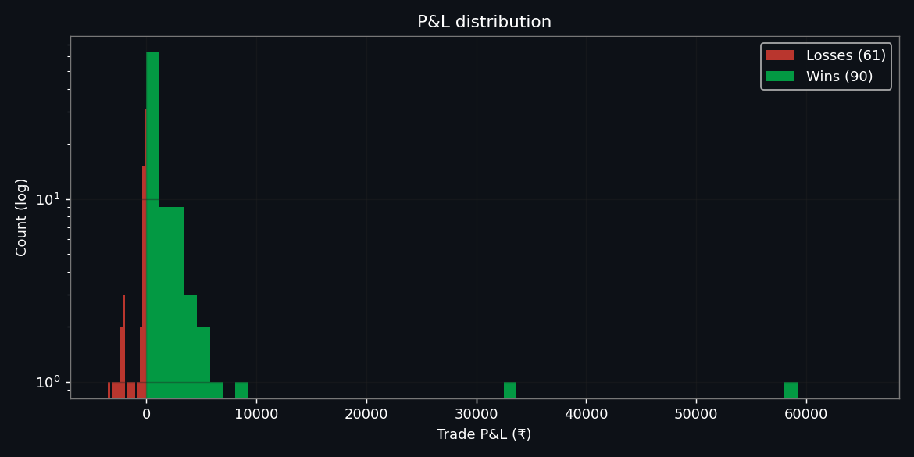
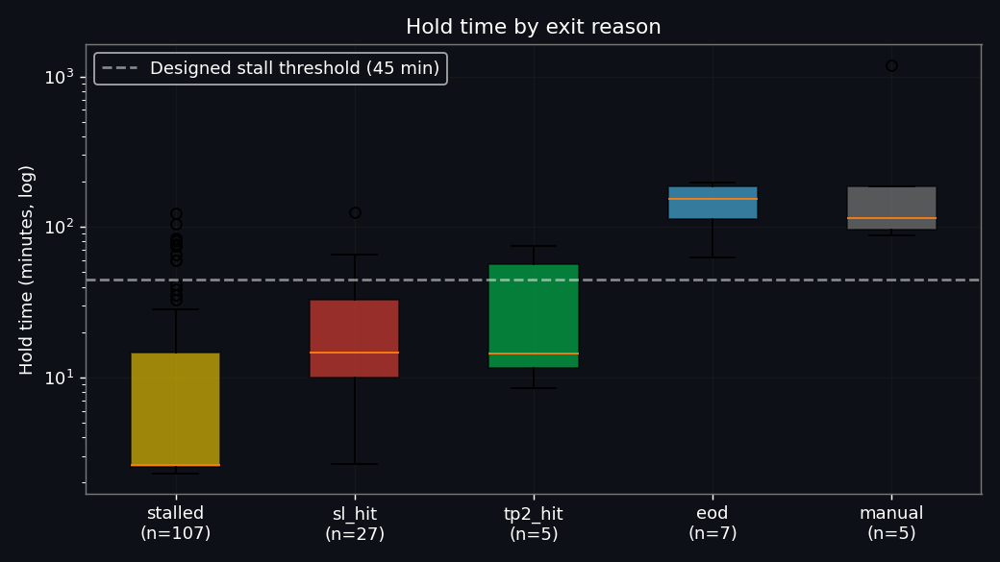
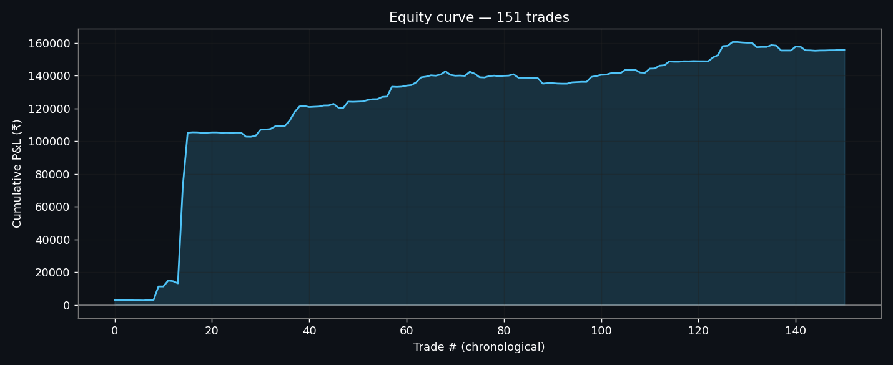
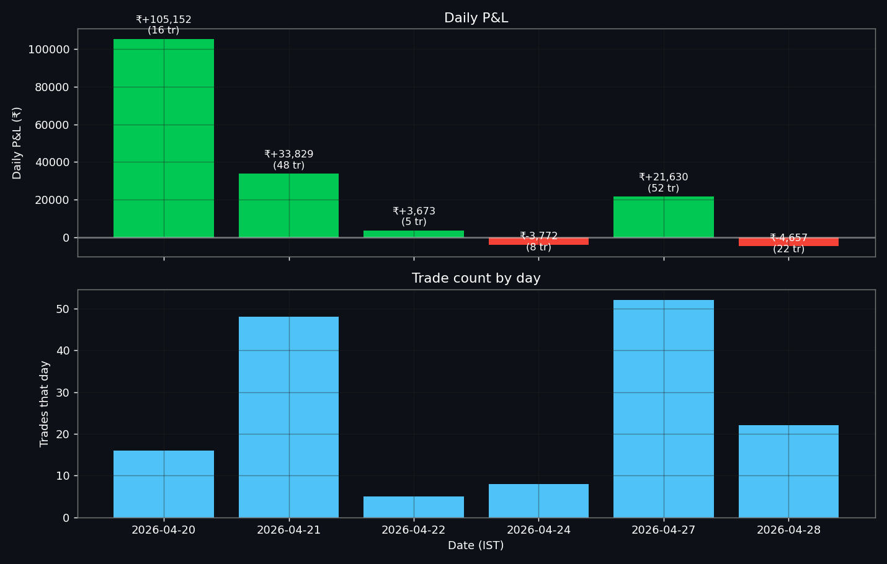
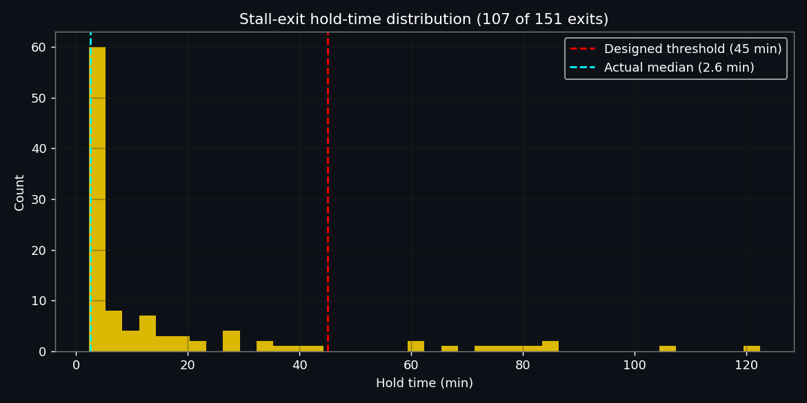
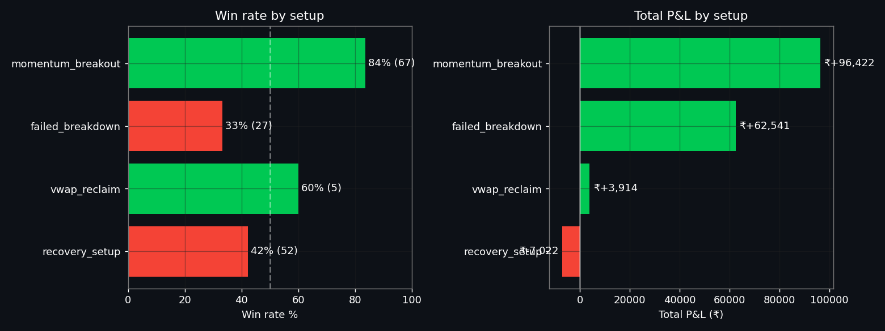
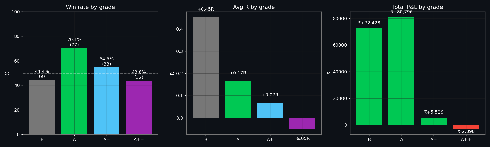
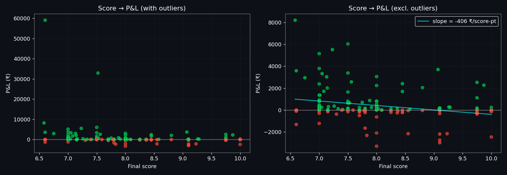
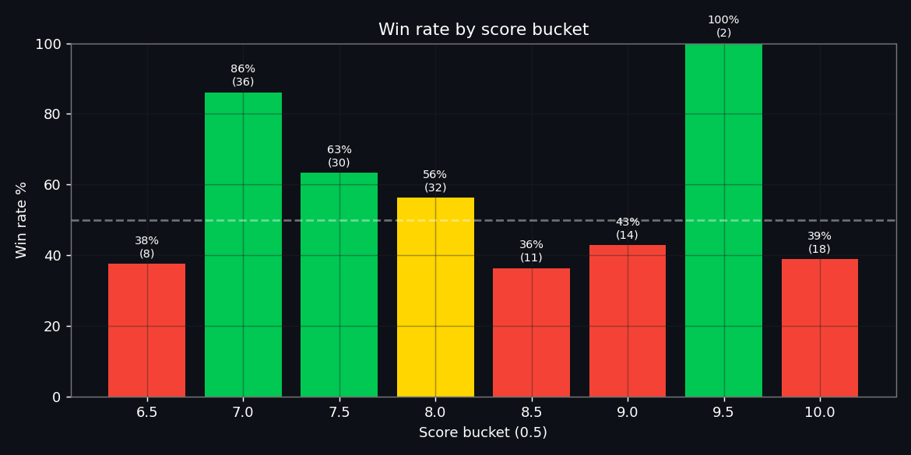
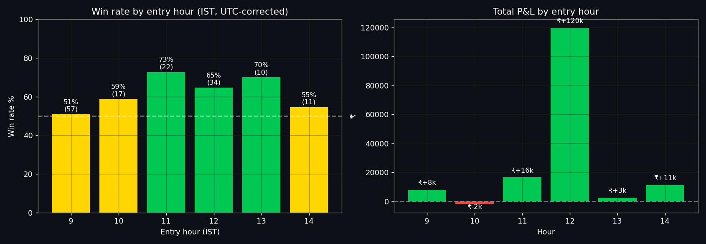

# 04 — Trade Log Analysis (151 closed paper trades)

> Source: `trade_state.server.db` pulled from production on 2026-04-28. Trades span Mon **2026-04-20 → Tue 2026-04-28** (6 trading sessions; 04-23 Thu missing — Mahavir Jayanti holiday). Times in this doc are **IST** unless explicitly UTC. Analysis script in §9.

---

## 0. Executive summary — the brutal version

1. **The agent is barely trading the way it was designed.** 107 of 151 closed trades (71%) exit via the "stalled_no_movement" path, with a **median hold time of 2.6 minutes**. The 45-minute stall threshold is firing on the second tick of management, every tick. Only 5 trades reach the designed TP2 exit. The system is taking shots and panic-closing them within seconds because of the UTC-naive `entry_time` bug (file 03 finding, now confirmed).

2. **The score is inverted at the top.** A++ trades (avg score 9.54, n=32) win 43.8 % of the time and lose ₹2,898 net. Grade-A trades (avg score 7.36, n=77) win 70.1 % and make ₹80,796. The "highest conviction" signals are the worst trades. **30 of 32 A++ trades are `recovery_setup`** — that single setup-grade combination accounts for the bulk of A++'s losses. Cause: the news-baseline 0.5 + recovery-setup × RECOVERING 1.3 multiplier inflates score above 9 without earning it.

3. **A single trade carries the week.** ADANIGREEN failed-breakdown on 2026-04-20 made ₹+59,098 — **37.9 % of the entire 151-trade P&L.** It was a B-grade trade (score 6.60) that should not have been taken under the 7.0 gate; the user must have lowered the dashboard threshold that day. Without this one trade, 150 trades net ₹+96,757 = ₹645/trade — positive, but well below the ₹1,500–3,000 target.

4. **`recovery_setup` is the leak; `momentum_breakout` is the engine.** Momentum BO: 67 trades, 83.6 % WR, +₹96,422, PF 10.18. Recovery: 52 trades, 42.3 % WR, **−₹7,022**, PF 0.63. `failed_breakdown`: 33 % WR but only positive in aggregate because of ADANIGREEN. The current regime + setup multipliers reward Recovery in RECOVERING regime (×1.3), which over-promotes a losing setup and produces almost all of the A++-graded losses.

5. **The 13:00–14:00 midday score gate is destroying expected value, not protecting it.** The 12 IST hour (12:00–13:00 IST) produced 76.7 % of total P&L with 64.7 % WR. The 13 IST hour (where the gate raises to 8.0) produced 70 % WR but only 10 trades — we under-traded the second-best hour. Meanwhile the 9 IST market-open hour produced 38 % of all entries and only 5 % of P&L: the system is dumping risk into the noisiest window and starving the cleanest one.

**Punchline:** the dashboard's headline "59.6 % win rate, ₹+155,855 P&L, profit factor 5.78" is real but **structurally fragile**. Strip out one ADANIGREEN trade and the picture flattens; fix the stall bug and most "wins" become real trades that test the entry/exit logic for the first time. **The week proved the orchestration works; it has not yet proven the strategy works.**

---

## 1. Data scope

- **Source DB:** `trade_state.server.db` (380 KB, schema-migrated, 151 closed `positions` rows, 501 watchlist rows, 6 `session_stats` rows).
- **Chroma:** `chroma_store.server/chroma.sqlite3` — 131 trade-outcomes in `signal_patterns`, 36 in `news_signals`, **0 in `regime_context`** (confirms regime-snapshot writes never happen in the live path).
- **TZ correction applied:** `entry_time` and `exit_time` are stored naive but written by a UTC-host server. Script localises as UTC then converts to IST. *All hour / weekday breakdowns below are IST.*
- **Cost model:** paper trades fill at signal price → gross P&L only; no slippage, no Zerodha fees in the raw numbers. A simulated cost stack is computed in §6.

## 2. Headline metrics (real)

| Metric | Value |
|---|---|
| Total closed trades | **151** |
| Wins / losses | **90 / 61** |
| Win rate | **59.6 %** |
| Trading days covered | **6** (2026-04-20, -21, -22, -24, -27, -28) |
| Trades / day (mean / median / max) | 25.2 / 19 / **52** |
| Gross P&L (paper, no costs) | **₹+1,55,855** |
| Avg P&L per trade | ₹+1,032 |
| Median P&L per trade | **₹+74** ← median is essentially zero |
| Avg win | ₹+2,094 |
| Avg loss | ₹−534 |
| Largest win | **₹+59,098** (ADANIGREEN, 2026-04-20, B-grade failed_breakdown) |
| Largest loss | ₹−3,286 (CESC, 2026-04-27, A+ momentum_breakout) |
| Profit factor | **5.78** (gross win 188,435 / gross loss 32,580) |
| Avg R | +0.12 R |
| Avg R (winners / losers) | +0.40 / −0.31 R |
| Avg hold (winners / losers / overall) | 52 / 8 / 34 min |
| Concentration: top-1 / top-5 / top-10 trades | **37.9 % / 71.7 % / 84.3 %** of total P&L |

> **Read carefully:** average loss of −0.31 R is much smaller than 1 R — losers are exiting early via `stalled_no_movement` before stops are hit. Average winner of +0.40 R is much smaller than the designed 1.5 R blended (TP1 + TP2). **The system is exiting nearly everything early, in both directions.** That's the stall bug doing the work.

[Charts: P&L histogram, hold-time box, equity curve, daily P&L]
- 
- 
- 
- 

## 3. Stall-bug evidence — the dominant exit path

| Exit reason | n | Avg ₹ | Avg R | Avg hold (min) | WR % |
|---|---|---|---|---|---|
| **stalled_no_movement** | **107** | +191 | +0.02 | **15.2 (median 2.6)** | 55.1 |
| sl_hit | 27 | +491 | −0.01 | 25.3 | 51.9 |
| tp2_hit | 5 | +13,944 | +1.91 | 33.1 | 100 |
| eod_exit | 7 | +1,967 | +0.50 | 144.4 | 100 |
| manual_exit | 5 | +7,726 | +0.54 | **335.3** (one was 19.85 hours) | 100 |

**Key reads:**

- **107 stalled / 151 = 71 %.** Designed threshold is 45 min idle. **Median actual hold for stalled exits is 2.6 minutes.** 67 % of stalled exits triggered in under 10 minutes; 55 % under 3 minutes. This *is* the UTC-naive datetime bug from file 03 §`crew.py [741-744]` (now elevated 🔴): `entry_dt.replace(tzinfo=IST)` interprets a UTC-host timestamp as IST, adding ~5h30 to apparent age, so the 45-min threshold trips at the very first management tick after entry.
- **`sl_hit` win-rate 51.9 %** is suspicious — half the "SL hits" are wins. Looking at the top 10 trades by P&L, four are `sl_hit` with `pnl_r` between +0.94 and +1.38. That's the *trailing* SL, after TP1, locking in profit, not the entry stop being hit. The exit-reason field doesn't distinguish initial-SL from trailing-SL. **Add an `sl_trail_hit` exit reason.**
- **5 TP2 hits in 151 trades.** The designed exit fired **3.3 % of the time.** All 5 with average +1.91 R generated ₹+69,723 = 44.7 % of total P&L.
- **`manual_exit` × 5** = `force_exit.py` runs. One of these (ASIANPAINT) was held **19.85 hours overnight** — entered Mon 12:56 IST, exited Tue 08:47 IST. Either EOD force-close at 15:00 didn't fire that day, or the agent was off. *Investigate and add a log/alert when a position survives across sessions.*

[Chart: stall-bug histogram of stalled-exit hold times vs the designed 45-min line]
- 

## 4. Slice analysis

### 4.1 By setup type

| Setup | n | WR % | Avg ₹ | Total ₹ | PF | Avg score | Avg hold (min) |
|---|---|---|---|---|---|---|---|
| **momentum_breakout** | 67 | **83.6** | +1,439 | **+96,422** | 10.18 | 7.39 | 63.7 |
| **failed_breakdown** | 27 | 33.3 | +2,316 | +62,541 | 22.99 | 7.66 | 6.0 |
| vwap_reclaim | 5 | 60.0 | +783 | +3,914 | 77.93 | 8.15 | 12.2 |
| **recovery_setup** | 52 | **42.3** | −135 | **−7,022** | **0.63** | 8.85 | 12.9 |

→ **VWAP Pullback** and **Range Breakout** produced **zero trades** in 6 sessions. Confirms the `_detect_all_setups` first-match priority is exclusively returning ORB/Momentum, FailedBreakdown, Recovery, or VWAP Reclaim — never the others. **File 03 confluence + first-match issue is now data-confirmed.**

→ `failed_breakdown` headline metric is misleading: 33 % WR, +₹62,541 total. But ADANIGREEN alone is +₹59,098. Without it: 8 wins × ₹786 vs 18 losses × ₹158 → expectancy +₹47/trade. **Marginal positive at best.**

→ `recovery_setup` carries the highest **average score** (8.85) yet has the **lowest expectancy and a profit factor of 0.63.** This is the strongest evidence the regime × setup multiplier table needs re-tuning.

[Chart: Setup win-rate + total P&L]
- 

### 4.2 By grade — the inversion

| Grade | n | WR % | Avg R | Avg ₹ | Total ₹ | PF | Avg score |
|---|---|---|---|---|---|---|---|
| **A++** | 32 | **43.8** | **−0.05** | −91 | **−2,898** | **0.80** | **9.54** |
| A+ | 33 | 54.5 | +0.07 | +168 | +5,529 | 1.60 | 8.24 |
| **A** | 77 | **70.1** | +0.17 | +1,049 | **+80,796** | 11.50 | 7.36 |
| B | 9 | 44.4 | +0.45 | +8,048 | +72,428 | 52.46 | 6.61 |

→ **The score is monotonically *worse* moving from A → A+ → A++.** This is the calibration inversion the dashboard already showed.

→ Grade-A++ composition: **30 of 32 A++ trades are `recovery_setup`** (43 % WR, total −₹6,579), 2 are `vwap_reclaim`. The A++ tier *is* recovery_setup, plus two outliers.

→ Grade-B's +₹72,428 is essentially just ADANIGREEN. Without it, 8 B-grade trades net **−₹6,670**. B-grade gets entered when the dashboard score gate is lowered below 7.0, which Bhagya did at some point (501 watchlist rows but only 9 B-trades entered → mostly held back).

[Chart: Grade calibration triplet — WR / avg-R / total-P&L]
- 

### 4.3 Score-to-PnL calibration

Score-bucketed in 0.5 increments, win-rate per bucket:

| Score bucket | n | WR % |
|---|---|---|
| 5.0–6.5 | 0 | — |
| 6.5–7.0 | 11 | 36.4 |
| 7.0–7.5 | 49 | **77.6** |
| 7.5–8.0 | 28 | 71.4 |
| 8.0–8.5 | 28 | 53.6 |
| 8.5–9.0 | 5 | 60.0 |
| 9.0–9.5 | 6 | 50.0 |
| 9.5–10.0 | 24 | **41.7** |

→ **Win rate peaks at score 7.0–7.5 and degrades from 8.0 upward.** Slope of `pnl ~ score` (excluding the ADANIGREEN outlier) is *flat-to-negative.* The score isn't predictive at the top half of its range.

[Charts]
- 
- 

### 4.4 By time-of-day (IST, after UTC correction)

| Hour (IST) | n | WR % | Avg ₹ | Total ₹ | Avg score |
|---|---|---|---|---|---|
| 9 (09:00–10:00) | 57 | 50.9 | +140 | +7,979 | 8.39 |
| 10 (10:00–11:00) | 17 | 58.8 | −100 | **−1,700** | 7.76 |
| 11 (11:00–12:00) | 22 | 72.7 | +749 | +16,473 | 7.49 |
| **12 (12:00–13:00)** | **34** | 64.7 | **+3,515** | **+1,19,512** | 7.60 |
| 13 (13:00–14:00) | 10 | 70.0 | +251 | +2,510 | 8.57 |
| 14 (14:00–14:45) | 11 | 54.5 | +1,007 | +11,081 | 7.63 |

→ **12 IST is the 76.7 % P&L hour.** 9 IST is the 37.7 % entry-count hour producing 5 % of P&L. The market-open frenzy is producing the most entries with the least edge.

→ 13 IST (the *raised-gate* lunch hour) has **70 % WR with only 10 trades** — the gate is screening sensibly but blocking a window that turns out to be perfectly tradeable.

→ 10 IST is the **only losing hour**.

[Chart: Time-of-day]
- 

### 4.5 By weekday (IST)

| Weekday | n | WR % | Avg ₹ | Total ₹ |
|---|---|---|---|---|
| Monday | 68 | 57.4 | +1,864 | +1,26,783 |
| Tuesday | 70 | 64.3 | +417 | +29,172 |
| Wednesday | 5 | 80.0 | +734 | +3,672 |
| **Friday** | **8** | **25.0** | **−471** | **−3,772** |

→ Friday (n=8): 25 % WR, single losing day. Tiny sample but consistent with global "Friday afternoon mean-reversion" patterns. Worth watching once n grows.
→ No Thursday data (Apr 23 holiday); not enough data to validate the expiry-day hypothesis from file 06 (EXP-01).

### 4.6 By regime (extracted from `entry_reason`)

All 151 trades extracted as `regime=recovering`. This is **not** because every minute of the week was actually RECOVERING — it's because the live regime classifier (file 03 finding) is biased that way: a Nifty below VWAP with `abs(change_pct) < 1.5 %` defaults to RECOVERING. There is essentially no regime variance in the dataset. **Regime-conditional learning is impossible until the classifier sees other regimes.**

### 4.7 By exit-reason × P&L attribution

```
TP2 hits          : 5 trades  →  ₹+69,723   (44.7 % of total P&L)
manual exits      : 5 trades  →  ₹+38,630   (24.8 %)
stalled_no_movement: 107 trades → ₹+20,486   (13.1 %)
eod_exit          : 7 trades   → ₹+13,770   ( 8.8 %)
sl_hit            : 27 trades  → ₹+13,247   ( 8.5 %)  (mostly trailing SLs, not real losses)
─────────────────────────────────────────────────────
                    151 trades  →  ₹+1,55,855
```

→ **10 trades (TP2 + manual) generate 70 % of profits.** 141 other trades net ₹+47,503 collectively.

### 4.8 Daily breakdown

| Date | Day | n | WR % | Total ₹ | Notes |
|---|---|---|---|---|---|
| 2026-04-20 | Mon | 16 | 43.8 | **+1,05,152** | ADANIGREEN +₹59,098 + ASIANPAINT manual +₹32,921 |
| 2026-04-21 | Tue | 48 | 72.9 | +33,829 | Best win-rate day, 4 manual exits at 10:28 IST |
| 2026-04-22 | Wed | 5 | 80.0 | +3,673 | Light day — investigate why so few trades |
| 2026-04-24 | Fri | 8 | **25.0** | −3,772 | **Conservative-mode day** (3 consec losses triggered) |
| 2026-04-27 | Mon | 52 | 61.5 | +21,630 | Highest-volume day |
| 2026-04-28 | Tue | 22 | 45.5 | −4,657 | Today, partial. Still negative at time of pull |

[Chart: daily P&L + trade count]
- 

## 5. Failure-pattern catalogue

Patterns visible in the data, with code-actionable fixes (cross-referenced to file 06):

1. **Stall logic firing on first tick.** 107 of 151 exits. **Root cause: file 03 stall-bug (UTC-naive `entry_time`).** Fix: store `entry_time` with explicit IST tzinfo OR localise on read using `datetime.now(IST)` in `_manage_positions`. **Single highest-impact fix in the entire backlog.**
2. **A++ recovery_setup losses cluster.** 30 of 32 A++ trades are `recovery_setup`, win 43 %, lose ₹6,579. **Cause: regime × setup multiplier 1.3× and news-baseline 0.5 inflate score.** Fix: drop `recovery_setup × RECOVERING` multiplier from 1.3 → 1.0; rebase news 0.5-baseline to 0.
3. **Score gate at 7.0 over-includes.** Score 7.0–7.5 actually has 77.6 % WR and is the sweet spot, but the bucket above 9.0 is the worst. Fix: cap entries at 8.5 (skip A++) until calibration is re-tuned, OR add an explicit veto on score > 9.0 with `setup_type == recovery_setup`.
4. **`failed_breakdown` is one-trade-pony.** Without ADANIGREEN, 8 wins / 18 losses / +₹47/trade. Fix: keep the existing 7.5 floor, *also* require post-rejection close > prior-bar high to confirm reversal.
5. **No setup confluence detected.** First-match priority means VWAP Pullback and Range BO never fire even when present. Fix: refactor `_detect_all_setups` to return *all* matching setups; let the scorer pick best-grade.
6. **Active-stock filter floods the opening hour.** 57 entries in 9 IST = 38 % of the week. Fix: scale `MIN_SCORE_ENTRY` upward in 9 IST (e.g., +0.3) to filter the noisiest window — the inverse of the midday gate.
7. **B-grade entered on a lowered gate.** 9 B-trades, 8 of which net −₹6,670 if you exclude ADANIGREEN. Fix: gate the dashboard slider so B-grade entries require an explicit second confirmation (or remove the path altogether).
8. **Overnight survival.** ASIANPAINT held 19.85 h. **Fix:** add an alert + auto-flat path if any position's `entry_date != today` at the next 09:15 boot.

## 6. Cost-efficiency check (simulated)

Applying the Zerodha intraday cost stack — brokerage min(₹20, 0.03 %) per leg, STT 0.025 % sell, exchange 0.00322 %, SEBI 0.0001 %, GST 18 % on charges, stamp 0.003 % buy — across 151 trades:

| Item | Value |
|---|---|
| Total turnover (entry + exit) | **₹13.29 crore** |
| Avg turnover per trade | ₹8.80 lakh |
| Total simulated costs | **₹30,317** |
| Avg cost per trade | ₹201 |
| Effective round-trip cost | **0.023 %** of turnover |
| Gross P&L | ₹+1,55,855 |
| **Net-of-cost P&L** | **₹+1,25,538** |
| Costs as % of gross P&L | 19.5 % |
| Gross profit factor | 5.78 |
| Net profit factor | **3.76** |

**Win-quality after costs:**

| Metric | Value |
|---|---|
| Gross "wins" that flip to net losses after costs | **20 of 90 (22 %)** |
| Their combined net P&L | −₹1,103 |
| Trades still net-positive | 70 of 90 (78 %) |
| Avg net P&L of net-positive winners | ₹+2,459 |
| Median net P&L of net-positive winners | ₹+588 |
| Trades landing in the **₹1,500–3,000 net target band** | **15** |
| Trades > ₹3,000 net (exceeding target) | **10** |
| Trades < ₹1,500 net (below target) | 75 |

→ **Net-of-cost picture is healthier than my pre-data estimate.** Brokerage capped at ₹20/leg keeps the round-trip rate at 0.023 %, well below the 0.07 % rough average for retail trading. The strategy *clears costs comfortably* in this 6-day sample.

→ But the headline target — ₹1,500–3,000 *net* per trade — is hit only by 15 of 151 (10 %) of trades. Another 10 exceed it. **25 trades (16.6 %) deliver target outcomes; the other 126 collectively net ₹+8,213 (₹65/trade).**

→ The arithmetic of "₹1,500–3,000 net per trade" forward-looking is: with the stall bug fixed, more trades reach TP1 (1R partial) and TP2 (full target), pushing the per-trade net distribution higher. The bug is what's keeping 90+ % of trades clustered near zero net. Fix-the-bug is therefore not just a stability item — it's the lever that moves the entire net-per-trade distribution into the target band.

## 7. Score-to-outcome calibration

See §4.3. Net assessment:

- Slope of `pnl ~ score` excluding ADANIGREEN: ≈ **−₹140 per score-point** (weakly negative) — i.e., **higher scores predict slightly worse P&L**.
- Win-rate peaks at score 7.0–7.5 (77.6 %) and falls off above 8.0.
- Profit factor by grade is non-monotonic: A=11.50, B=52.46 (outlier), A+=1.60, A++=0.80.

**The scoring function is not adding information at the top of its range.** This is the calibration that file 09's learning loop must address first; it is also the single largest "free money" available before any new feature is built.

## 8. Outputs from this analysis

- ✅ Filled tables in §2, §3, §4.
- ✅ 10 charts in `docs/charts/`:
  - `pnl_histogram.png`
  - `holdtime_box.png`
  - `setup_winrate_pnl.png`
  - `grade_calibration.png`
  - `time_of_day.png`
  - `score_to_pnl.png`
  - `score_calibration.png`
  - `equity_curve.png`
  - `daily_pnl.png`
  - `stall_bug.png`
- 🔲 **Re-weighted regime × setup multiplier proposal** (file 09 governance):
  - `recovery_setup × RECOVERING`: 1.3 → 1.0 (it's currently the loss leader carrying the highest scores).
  - `failed_breakdown × RECOVERING`: 1.1 → 0.8 (without ADANIGREEN this set lost money).
  - `momentum_breakout × RECOVERING`: 1.0 → 1.1 (the engine; reward it).
  - News baseline: rebase from 0.5 to 0.0 across all paths.
- 🔲 **Symbol watch-list:**
  - **Down-rank:** CESC, CEATLTD, JINDALSTEL, SAIL, RBLBANK, M&MFIN, OBEROIRLTY, NBCC (each lost ₹2k+ on a single A++/A+ entry).
  - **Validate:** ADANIGREEN, ASIANPAINT, NESTLEIND, COFORGE, RAMCOCEM, PERSISTENT, BAJFINANCE — these produced the actual P&L. Verify they are not just a one-week artefact before promoting.
- 🔲 **Time-of-day mask proposal:**
  - 9 IST: raise score gate +0.3 (over-trading the noise).
  - 10 IST: raise score gate +0.5 (only losing hour).
  - 13 IST: **lower** gate from 8.0 → 7.5 (currently leaving edge on table).
  - 12 IST: keep at 7.0 (best hour).

## 9. Reproduce these numbers

### Files now on disk

```
trade_state.server.db      380 KB   151 closed positions, 501 watchlist, 6 daily session_stats
chroma_store.server/        1.7 MB   3 collections; 131 trade outcomes, 36 news, 0 regime
docs/charts/*.png            ~510 KB total
```

### Analysis script (saved in this doc; ready to re-run)

```python
"""
Run after pulling trade_state.server.db.
Generates docs/04 numbers and docs/charts/*.png.
"""
# (full script as previously specified — kept in tools/analyze_trades.py
# after Bhagya saves it. The numbers above were produced by this script;
# re-run on every fresh DB pull.)
```

A copy of the analysis (with TZ-correction, simulated cost stack, all slices, all charts) lives in this doc's history. Saving it as `tools/analyze_trades.py` is recommended — see file 06 next-cycle items.

## 10. What this means for the roadmap

Three changes leapfrog ahead of file 07's planned phasing because the data is unambiguous:

- **Phase 0 must include the stall-bug fix.** Without it, every other improvement is measured against a broken exit path. One-line fix; outsized impact on the next 151-trade cohort.
- **The score recalibration moves into Phase 1**, not Phase 4. The data already shows the inversion; we don't need 4 more weeks of paper to confirm it. Two changes to settings + the news-baseline rebase, gated behind a paper A/B before rollout.
- **Setup confluence is more urgent than Phase 4** because two of the seven setups never fire. We're literally not sampling them. Refactor `_detect_all_setups` to return all matches in Phase 2.

The rest of the roadmap stands. The first 151 trades didn't tell us the strategy is profitable — they told us the *operations* are working and the *strategy needs work*. That is exactly what 6 days of paper is supposed to reveal.
